# Loom 2022

*A quick and very rough guide*

## Introduction

What is Loom?

Loom is a Scala based drawing engine.  Loom can do a range of things.  It can display 2D and 3D images, play audio, respond to serial input, etc.  Any particular instantiation shapes a 'sketch', with its own subdirectory in the project and its own version of the 'MySketch' file.

Developing from work I did a decade ago, Loom 2022 focuses on polygonal subdivision. It subdivides simple 2D geometrical shapes to produce more complex shapes.  These shapes become sprites that are positioned on screen for drawing.  Animation is possible but options are currently very limited.  My interest has been in recursive subdivision, the transformation of created shapes and their high resolution rendering (as stills).  There is scope for 2D shapes to gain an additional z dimension, but this requires maintenance - and really should begin with dedicated 3D models rather than simply adding depth data to 2D planes.

Loom represents, for me, an exploratory space.  I've left it without any GUI so that it can evolve organically as a piece of code and conceptual invention.  My aim here is less to finalise the project than to provide a snapshot, indicating its key operations and features.  The whole thing has become so complex that I need a guide for myself so that I don't lose track of how it works. This is a minimal and largely private overview.  So be warned!

One final introductory point.  Loom is scarcely a conventionally useful bit of graphics software.  Normally subdivision provides a means of modelling further detail in shapes.  Here it simply produces visual patterns - curiously rendered drawings of geometry and things.  Recently, however, I've come across a possibly use.  Loom would work well for geometrically stylised UV mapping.  The polygon sets could represent UV maps and subdivision could 'paint' the maps.

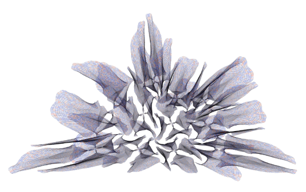

***


## Set Up

1. Download the project and place somewhere convenient on your system.
2. Install all the necessary foundation code - Java, Scala and SBT (Homebrew makes this easy).  I also use VScode as my IDE.
3. From VScode terminal open up the Loom project.
4. `sbt` command to run SBT: sbt -J-Xmx2G (note extra flag setting larger heap size)
5. `run Subdivide config_default.xml` to run Loom.  This runs the 'Subdivide' sketch, taking some basic configuration settings from the 'config_default' xml file in the 'Subdivide' sketch subdirectory.
6. this opens up a JFrame that displays a JPanel of whatever it is that the current settings are enabling (usually some kind of subdivided shape).
7. To develop your own shapes to subdivide you will need to install 'Bezier Draw' - this is a simple bezier drawing Java app that saves polygon sets for use in Loom 2022.  One bit of awkwardness: you will need remove the 'doc type' definition from the xml file to make it work in Loom 2022.  Loom 2022 does no 'doc type' verification, whereas 'Bezier Draw' follows Java standards and works with a DTD.  Must adjust this, preferably so that my Scala code also references relevant DTD.  This will mean that I can build a JavaFX, or possibly Electron, GUI frontend that links to the XML backend and to the running Scala application.  But for the time being just get rid of the first two lines once you copy the xml file from Bezier Draw to Loom 2022:

```xml
<?xml version="1.0" encoding="ISO-8859-1"?>
<!DOCTYPE polygonSet SYSTEM "../../dtd/polygonSet.dtd">
```

***


## Directory Structure

The Loom project folder contains:

1. **build.sbt**: build file for SBT.
2. **Lib**: various libraries that Loom needs. THe most important are the scala libaries.  The other libraries, 'librxtxSerial.jnlib' and 'RXTXcomm.jar' are only needed for microcontroller access to another sketch.  Not using 'akka-actor.jar' anymore (I don't think).  'Easing.jar' is an Java animation interpellation library that I really should be using in the Subdivide sketch, but am not currently.
3. **Project**: SBT generated leave alone, but worth running `clean` command every often in SBT to get rid of old project builds, which can rapidly accumulate and take up a lot of space.
4. **sketches**: as mentioned above, these are the different instantiations of the Loom engine, each with different features.  Note that the 'Subdivide'  directory includes a folder for renders ('captures') that has separate folders for stills and video (a set of frames), a config directory, a projects directory (not used yet) and a resources folder. The latter contains subdirectories with different xml files representing different shapes (stick with 'polygonSet', which is what gets produced in 'Bezier Draw').  It also includes the overall 'MySketch.scala' file that provides the entry point to the project.
5. **src**: the source directory (org)
6. **target**: SBT again
7. **tutorial**: mainly old stuff so no longer relevant.  'Loom technical development' provides an overview of the subdivision engine, but describes the original straight line based system.  You can still use this system, but it has largely been superseded by the current spline based system.  The lingering advantage of the line system, however, is that it offers many different types of subdivision (described in the tutorial document).  These can be recursively layered to create very complex subdivision.  The spline system only offer quad and tri subdivision currently, but offers the capacity to deal with curved polygons and many more options for the transformation of shapes.

***


## Concepts

My focus is on how 2D spline based polygonal subdivision is conceived within Loom 2022.

Polygons are composed of splines. A rectangle, for example, is composed of four splines - one for each line in the shape. Each spline is composed of four points - two anchors at either end and two associated control points, which control the curvature of the line.  I guess you could create a polygon with just two splines, but we tend to begin with three or more splines (sides).  So, as I say, a rectangle is composed of four splines, which has 16 points altogether.  The final anchor point on each spline has a sibling (and a shared location) that is the origin anchor point on the first spline.

The overall geometrical hierarchy is has **points** at the base, then **splines** that are composed of four points, **polygons** that are composed of splines and then **polygon sets** that are composed of one or more polygons.  Beyond this we also have **collections** of polygon sets, but more on that later.

The subdivision of polygons can take many forms, but I have only implemented two:
1. **quad**: begin at the origin point on the poly, calculate the centre of the first line (side 1), then from there to the centre of the polygon (side 2), then out to the middle of the final side of the polygon (side 3) and back to the origin (side 4) (which is also the last point in the overall set of 16 points).  Then on to the second point in the original polygon to calculate the next sub-poly. Etc. So the process proceeds in a circular fashion through each of the points in the original polygon to calculate a new polygon from each starting position.  This method works for any polygon with two or more sides.

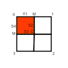
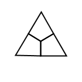

2. **tri**: begin at the origin point again, but this time goes straight to the centre (side 1), then out to the penultimate spline's first anchor point (side 2), and then back to the origin (which is also the last point in the overall set of 12 points).  Etc.

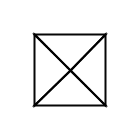
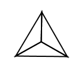

These two methods are pretty straightforward really. Where the complexity comes in lies in a number of factors:
1. subdivisions can be applied **recursively** so that we can start with a single polygon and end up with many thousands of polygons once a handful of stages of subdivision is applied.
2. the stages can involve the combination of **different modes of subdivision** - so you can switch from quad to tri and then back again as you like.  There is scope to develop further modes, however they should be applicable in a generic manner to any given polygon with any number of sides.
3. each cycle of subdivision can have different **parameters** that affect the nature of the subdivision.  This can involve, for instance, calculating a random centre in each polygon, varying the 'middle' point on subdivided lines and applying complex polygon and point level transformations to the subdivided polygons.  These transformations can either be fully specified or probabilistically randomised.  You can have a subdivided shape in which, for instance, 7% of the polygons have had some minor random translation in their position or have been bulged outwards are their sides.  Applied at scale across multiple polygons this can produce very complex patterns and shapes.
4. all sorts of **rendering** parameters are also possible - lines, colours, transparency can all be varied either deliberately or with a level of (systematic) randomisation.
5. There is also scope to **animate** shapes, which adds another dimension of complexity, although this requires further development and only works efficiently with less complex shapes.

So far I have been using the term 'shape' informally, but within the system there is a distinction made between **shapes** and **sprites**.  Shapes are conceived as abstract containers for sets of polygons.  Shapes are concretely realised in sprites that have a position on screen and that can be transformed, animated and rendered. The subdivision process is applied to the shape (to expand the set of polygons) before sprites are created.  You can actually bypass subdivision altogether if you like and just employ the basic polygons from Bezier Draw.  This facilitates much speedier display and rendering.

Overall, here is the overall process:
1. configuration: define overall environment - screen size, etc.
2. define a rendering library composed of a set of renderers and some rules for how rendering will be applied.
2. load some polygon sets from the 'resources/polygonSets' folder
3. define a set of subdivision parameters (if you wish)
4. create  a set of shapes from the polygon set
5. apply the set of subdivisions to the set of shapes (each shape can have a different subdivision set applied)
6. create a set of sprites that instantiate the shapes and have their own rendering set
7. animate the sprites if you wish
8. render the sprite to screen
9. capture the images as stills (either a single image or as sequence of stills in an animation)


***


## Configuration

The following details go into a configuration file, 'confi_default.xml', which is located in `Loom/sketches/Sudivide/config`.
1. **name**: String (the name of the sketch)
2. **width**: Integer (width of the screen/rendered image)
3. **height**: Integer (height of the screen/rendered image)
4. **qualityMultiple**: Integer. A value of 1 renders at 1 to 1 between screen width and height and render output.  Higher values increase the pixel dimensions.  A value of 12 creates a high resolution image for my purposes.  Important to note that if you choose a higher value than 1 then the displayed output will only display the top left rectangular portion of the output at current width and height, so at 12 you will typically only see a white screen.  You need to save the image (Cmd S) and then open it to check the render.
5. **animating**: Boolean value (is animating happening?)
6. **fullscreen**: Boolean value (full screen window?)
7. **bordercolor**: RGB value (red: 0-255, green: 0-255, blue: 0-255) (If you want border colour for the image)
8. **serial**: Boolean value.  (No reading of serial input in this sketch so 'false'
9. **port**: serial related (not relevant for this sketch)
10. **mode**: serial related (not relevant for this sketch)
11. **quantity**: serial related (not relevant for this sketch)

*Note to self: move all of this into a start screen via JavaFX/Electron, whatever.*


***


## MySketch

The main code that you will be dealing with **MySketch.scala** contained in 'mysketch' directory of `src/main/scala/org/loom`.

Here is where you define renderers, polygon sets, subdivision parameters, etc.  This is also the place that contains the main update and draw loop.  You will most likely have to check other pieces of code now and then, but you should aim to get most things done in MySketch.


***
***


## Rendering

Individual renderers, which define rendering features and can include RenderTransforms, can be combined into named sets.  These sets are themselves added to an overall library of renderer sets

RendererSetLibrary/
├── RendererSets/
│   ├── Renderers
│       │───RenderTransforms

Rendering is called from `Sprite2D`.

The MySketch constructor calls an internal method, `makeRendererSetLibrary`, which is where renderers get added to rendererSets and then the sets get added to the rendererSetLibrary.


You only need to modify fields that differ from the defaults defined in Renderer, RendererSet and RendererSetLibrary.  All of these fields are defined below.

***

Here are details on the various rendering classes.  Double check these correspond to the actual classes.  The classes themselves provide the accurate version of the implementation - the version here may be slightly out of date.


### Renderer

Here are the field associated with individual renderers:

Firstly there are parameters that are passed in when the renderer is created:

1. **name**: String
2. **mode**: Int (0 (points: Renderer.POINTS), 1 (lines: Renderer.LINES), 2 (filled: Renderer.FILLED), 3 (filled_stroked: Renderer.FILLED_STROKED))
3. **strokeWidth**: Float
4. **strokeColor**: Color (RGBA)
5. **fillColor**: Color (RGBA)

Following these basic Java2D parameters, there are a large number of internal fields linked to ways that features of rendering can be modified either in sequence or randomly for each polygon in a polygonSet.  So, for instance, the strokeWidth value could gradually increase for each polygon drawn, or a random mode of rendering could be selected for each polygon, etc.

Important to note that all of these changes happen at the level of the individual renderer.  It is also possible vary rendering at the level of the renderSet, but more about this soon.

##### Overall fields

These determine whether modification of the point happens when renderer is called (from sprite2D).

1. **static**: Boolean (if true then no modification of point drawing)
2. **changeMode**: Boolean (between points, lines, filled or stroked_filled. Change can be sequential or random)
3. **changePoints**: Boolean (switch for modifying point rendering parameters)
4. **changeStrokeWidth**: Boolean (switch for modifying strokeWidth rendering parameters)
5. **changeStrokeColor**: Boolean (switch for modifying strokeColor rendering parameters)
6. **changeFillColor**: Boolean (switch for modifying point fillColor parameters)

##### Sequential rendering modification fields

1. **sequenceParameterChange**: Boolean (if true then incremental modification of rendering parameters.  Also if true then randomised change does not happen.  Sequential and randomised change are mutually exclusive)
2. **modeIndex**: Integer (initial rendering mode index: 0 for points, 1 for lines, 2 for filled, 3 for filled stroked)
3. **modeIncrementAmount**: Integer (how much to increment mode each rendering call: typically 1)
4. **modeList**: List[Integer] (the list of mode indexes referenced for sequential change)
5. **strokeWidthIncrementAmount**: Float (how much to increment float amount)
6. **strokeWidthMin**: Float (minimum value for strokeWidth)
7. **strokeWidthMax**: Float (maximum value for strokeWidth)
8. **strokeColorMinList**: List[Integer] (RGBA minimums)
9. **strokeColorMaxList**: List[Integer] (RGBA maximums)
10. **strokeColorIncrementAmounts**: List[Integer] (RGBA increments)
11. **fillColorMinList**: List[Integer] (RGBA minimums)
12. **fillColorMaxList**: List[Integer] (RGBA maximums)
13. **fillColorIncrementAmounts**: List[Integer] (RGBA increments)

##### Randomised rendering modification fields

1. **randomParameterChange**: Boolean (if true then random changes to rendering determined by following parameters.  Mutually exclusive with sequenceParameterChange)
2. **randomModeArray**: List[Integer] (the set of modes to be randomly selected from, for instance: List(Renderer.POINTS, Renderer.LINES, Renderer.FILLED, Renderer.FILLED_STROKED))
3. **randomPointColorRange**: List[Range(min,max)] (random ranges across R, G, B and A)
4. **randomStrokeWidthRange**: Range(min,max) Float (random range of stroke width values)
5. **randomStrokeColorRange**: List[Range(min,max)] (random ranges across R, G, B and A)
6. **randomFillColorRange**: List[Range(min,max)] (random ranges across R, G, B and A)

##### Additional point related fields

Points are drawn as Ellipse2Ds.  This means they are essentially little circular shapes (perfect or oblong).  They are defined by the size of the shape (width and height) and by standard rendering parameters (strokeWidth, strokeColor, fillColor).

Note that the pointColor is not the same as the strokeColor.  The pointColor relates to the filled state of any Ellipse2D, not the stroke (outline).

1. **modifyPointStrokeWidth**: Boolean (overall switch for modifiying stroke width)
2. **pointStrokeWidthIncrement**: Float (how much to increment strokeWidth each call to renderer)
3. **pointStrokeWidthMultiplier**: Double (this has two purposes.  It is firstly a means of ensuring that the stroke width matches the overall rendering size of the image.  If the image is rendered large then the strokeWidth of the point drawing can, for instance, increase correspondingly.  Secondly, it makes it possible to iterate through a range of strokeWidth values each time the renderer is called.  This can produce a variety of different size points)
4. **pointStrokeWidthMultiplierRange**: Range(Integer min and max) (sets the min and max for incrementing the strokeWidth value)
5. **pointStrokeWidth**: Float (this is instantly set to the strokeWidth * pointStrokeWidthMultiplier, ensuring points are drawn appropriately depending upon the resolution multiplier (see Configuration details).
6. **pointColor**: Color(RGBA) (the fill color of point)
7. **pointColorMinList**: List [Integer] minimum RGBA values for pointColor
8. **pointColorMaxList**: List [Integer] maximum RGBA values for pointColor
9. **pointColorIncrementAmounts**: List[Integer] RGBA increment amounts
10. **modifyPointColor**: Boolean (overall switch for color modification)
11. **modifyPointFilled**: Boolean (switch for modifying the filled status of point)
12. **pointFilled**: Boolean (the filled status of point)
13. **modifyPointSize**: Boolean (switch for whether or not point size is modified. Note currently point size adjusted identically across width and height, not independently)
14. **pointSizeIncrement**: Double (for sequentially modifying the point size)
15. **pointSizeMultiplier**: Double (again for dealing with configuration based resolution multiplier changes and for sequentially or randomly modifying the size of points)
16. **pointSizeMultiplierRange**; Range (set min and max values for sequentially or randomly modifying point size)
17. **pointWidth**: Double (set to strokeWidth * pointSizeMultiplier)
18. **pointHeight**: Double (set to strokeWidth * pointSizeMultiplier)

***

### RendererSet

Alongside all the potential changes to individual renderers, it is also possible include rendering changes at the level of rendererSets.

A rendererSet is composed of a set of indiviudal renderers. You can select sequentially or randomly from rendererSets.  So you may have red, yellow and blue renderer and you can move between them in looping sequence as you render polygons, or select from the pool randomly.  Furthermore, you can combine these set level changes with the modification of individual renderer parameters, so that the red renderer, for instance, could cycle through a range of shades, or radically shift modes, etc.

Mainly, rendererSets are useful in terms of defining a limited palette of renderers that can be managed as a group.

Each RendererSet takes a name (String) as a parameter.

Here are the rendererSet fields:

1. **rendererSet**: ArrayBuffer of Renderers (so that sets can vary in size and renderers can be added and subtracted as needed)
2. **currentRenderer**: Renderer (the currently selected renderer)
3. **selectedIndex**: Integer (the index in the ArrayBuffer of the currently selected renderer)
4. **preferredRendererIndex**: Integer (you can prioritise one renderer, making it the one most likely to be chosen)
5. **preferredProbability**: Double (the associated percentage probability that preferred renderer will be chosen)
6. **staticRendering**: Boolean (if true then no sequential or random change of currentRenderer)
7. **modifyInternalParameters**: Boolean (modify parameters within individual renderers)
8. **sequenceIndexChange**: Boolean (accesses renderers in sequence from first to last and repeat - can then have subsequent modified individual renderer parameters.  Mutually exclusive from randomIndexChange)
9. **randomIndexChange**: Boolean (if true then selects a random renderer - can then have subsequent modified individual renderer parameters. Mutually exclusive from sequenceIndexChange)

***

### RendererSetLibrary

This is the overall collection of rendererSets.  It is possible to access sets in sequence or randomly.  Need to consider carefully at what level you want to manage change.  Probably easiest to begin at renderer level, then move up to rendererSets when that makes sense, and only finally to switching between rendererSets in the library.

The library itself has a name (String) as parameter when created.

Note that you tend to access rendererSets by name, but they can also be accessed by index.

Here are the rendererSetLibrary fields:

1. **library**: ArrayBuffer[RendererSet]
2. **currentRendererSet**: RendererSet
3. **selectedIndex**: Integer
4. **preferredRendererSetIndex**: Integer (the prioritised rendererSet when sequential or random access relevant (linked to probablility below))
5. **preferredProbability**: Double (the percentage probability that preferred renderer will be chosen)

***

### Convenience Methods

Although it is possible engage with all of these fields across all these different levels of the rendering architecture directly, it is much easier to interact with the complex set of Renderer and RendererSet fields particularly via a set of convenienct methods that are assembled in a long comment at the top of `makeRendererSetLibrary`.


#### Renderer

1. `setChanging(changeType: Int)` (Renderer.SEQUENCE or Renderer.RANDOM: **required for changing** and to specify type of change (sequential or random), otherwise renderer is static)

**Mode**

2. `setChangingMode(modes: List[Int])` (define list of modes to be either sequentially or randomly selected depending on changeType parameter to setChanging())

**Points**

3. `setChangingPointStrokeWidth(increment: Float, multiplier: Double, multiplierRange: Range)` (either sequential or random depending on setChanging() value)
4. `setChangingPointColor(colorMinList: List[Int], colorMaxList: List[Int], colorIncrementList: List[Int])` (set RGBA values sequentially or randomly depending on setChanging() value)
5. `setChangingPointSize(increment: Float, multiplier: Double, multiplierRange: Range)` (set size of Ellipse2D sequentially or randomly depending on setChanging() value)

**Stroke Width**

6. `setSequentiallyChangingStrokeWidth(increment: Float, min: Float, max: Float)` (only happens if setChanging set to sequential)
7. `setRandomlyChangingStrokeWidth(range: Range)` (only happens if setChanging set to random)
 * 
**Stroke Color**

8. `setSequentiallyChangingStrokeColor(min: List[Int], max: List[Int], increments: List[Int])` (only happens if setChanging set to sequential)
9. `setRandomlyChangingStrokeColor(RGBA_ranges: List[Range])` (only happens if setChanging set to random)

**Fill Color**

10. `setSequentiallyChangingFillColor(min: List[Int], max: List[Int], increments: List[Int])` (only happens if setChanging set to sequential)
11. `setRandomlyChangingFillColor(RGBA_ranges: List[Range])` (only happens if setChanging set to random)


#### RendererSet

**Convenience Methods for Configuring Render Sets**

Specify if sequential or random selection change within set and whether or not renderers can modify their internal fields. 

1. `modifyRenderers()` (enables individual renderers to modify their parameters)
2. `sequenceRendererSet(preferred: Int, prob: Double)` (preferred renderer index in set, probability that preferred is chosen)
3. `randomRendererSet(preferred: Int, prob: Double)`


### makeRendererSetLibrary() example

And here is an example of how `makeRendererSetLibrary` can be managed via the use of these methods,

```

def makeRendererSetLibrary(n: String): RendererSetLibrary = {
 	
 	//CREATE OVERALL LIBRARY
	val renderSetLibrary: RendererSetLibrary = new RendererSetLibrary(n)

    //CREATE A NEW RENDERER SET
	val renderSetA: RendererSet = new RendererSet("BlueOrangeGreenFilled")

    //CREATE A NEW RENDERER WITH CHANGING POINT PARAMETERS
	val rendererBlue: Renderer = new Renderer("Blue", Renderer.POINTS, defaultLineWidth, Renderer.BLACK, Renderer.BLUE)
	rendererBlue.setChanging(Renderer.SEQUENCE)
	rendererBlue.setChangingPointStrokeWidth(1, 2, new Range(1,5))//increment, multiplier, range)
	rendererBlue.setChangingPointColor(List(0,0,0,0), List(255,255,255,255), List(15,1,1,10))//minList, maxList, incrementList - all RGBA
	rendererBlue.setChangingPointSize(1, 2, new Range(1,5))
	renderSetA.add(rendererBlue)//ADD RENDERER TO SET

    //CREATE ANOTHER RENDERER WITH SOME CHANGING LINE PARAMETERS
	val rendererOrange: Renderer = new Renderer("Orange", Renderer.LINES, defaultLineWidth, Renderer.BLACK, Renderer.ORANGE)
	rendererOrange.setChanging(Renderer.SEQUENCE)//must call this method to enable changing renderer values, and must specify either sequential or random change
	rendererOrange.setChangingMode(List(Renderer.LINES, Renderer.FILLED, Renderer.FILLED_STROKED))//changes sequentially or randomly based on setChanging parameter
	rendererOrange.setSequentiallyChangingStrokeWidth(.1f, .1f, 1f)//increment, min, max (note: must have setChanging to sequential for this method to work
	renderSetA.add(rendererOrange)//ADD RENDERER TO SET

    //CREATE A THIRD RENDERER (FILLED_STROKED, BLACK LINES, GREEN FILL) WITH DEFAULT STATIC VALUES AND ADD TO SET
	renderSetA.add(new Renderer("Green", Renderer.FILLED_STROKED, defaultLineWidth, Renderer.BLACK, Renderer.GREEN))

    //DIRECTLY DEFINING SOME RENDERER SET FIELDS
	renderSetA.getRenderer("Blue").randomFillColorRange = List(new Range(10, 30), new Range(40, 70), new Range(100, 150), new Range(230, 255))
	renderSetA.getRenderer("Orange").randomFillColorRange = List(new Range(160, 240), new Range(40, 90), new Range(10, 30), new Range(20, 150))
	renderSetA.getRenderer("Green").randomFillColorRange = List(new Range(10, 30), new Range(90, 150), new Range(40, 70), new Range(20, 60))//NOTE: THIS WILL NOT HAPPEN BECAUSE 'GREEN' IS NOT SETCHANGING()
	renderSetA.setPreferredRenderer("Orange")
	renderSetA.setCurrentRenderer("Blue")
	renderSetA.modifyRenderers()//allows individual renderers to vary their parameters (otherwise they are static)
	renderSetA.randomRendererSet(1,100)//preferred renderer index, preferred probability
    
    //ADD THE RENDERER SET TO LIBRARY
	renderSetLibrary.add(renderSetA)
	renderSetLibrary.setCurrentRendererSet("BlueOrangeGreenFilled")
	renderSetLibrary.setPreferredRendererSet("BlueOrangeGreenFilled")

	renderSetLibrary//RETURN LIBRARY

}
```


***
***

### Visual Rendering example

Leaving aside the creation of the library and the individual set of renderers, here is an example of how an individual renderer can be created and configured.

We begin with a set of bare rectangles (polygonSet) created in Bezier.  This can be rendered by just creating a single renderer - let's just call it "Orange", even if not actually orange!

`val rendererOrange: Renderer = new Renderer("Orange", Renderer.LINES, defaultLineWidth*7, Renderer.BLACK, new Color(196,232,255,100))//name, mode, strokeWidth (default is very thin so applying a multiplier), strokeColor, fillColor`

Here is what this renders:


So, all just rendering as black lines with a consistend strokeWidth.

Now, let's render with each of the four possible modes (points, lines, filled and filled-stroked) in sequence.  To do this, we need to set changing to SEQUENCE, which also sets changing to TRUE, then we need to provide a list of rendering modes that will be employed in the spectified sequence.  The list can be as long as we like and can choreograph the modes however you like.  Just note that they denote a sequence that is applied to each polygon in turn.  Here all the polygons are distinct shapes and nothing has been subdivided.  If subdividing had been applied then the sequence would work through in terms of the total set of polygons.

Here is the code to render each row of shapes as a sequence of the four different rendering mode options:

`rendererOrange.setChanging(Renderer.SEQUENCE)		rendererOrange.setChangingMode(List(Renderer.POINTS,Renderer.LINES, Renderer.FILLED, Renderer.FILLED_STROKED))`


Within this overall sequence, we can also modify each of the different modes.  We could, for instance, change the size at which the points are drawn, keeping in mind that each point is drawn as an Ellipse2D that has a size

## Polygons/Shapes/Sprites

These components contribute to visible output:

1. **PolygonSets** are the abstract geometry of the shapes.  The individual polygons are composed of lines or cubic curves (splines).  They are defined in normalised terms around the shape centre (so plus or minus .5 on the x and y).  The sets are a static blueprint for shapes.
2. **Shape2Ds (or Shape3Ds)** are more concrete instance of geometry that can be subdivided and transformed, defined as a list of Polygon2D with associated subdivision parameters
3. **Sprite2D** contains a Shape2D and has a size and location, can be transformed and, most importantly, rendered.  The sprite gets updated and drawn as part of the main program loop


***


### PolygonSetCollection

Rather than dealing with single polygons, we define polygon sets that together compose an overall shape.  These are created in Bezier Draw (as discussed above).  Of course, a polygonSet can be just one polygon, so need for complexity if not needed.  The polygonSet just provides a container for one or more polygons to be subdivided, animated and rendered.

We are not restricted to a single set of polygons.  Multiple named polygonSets can be added to the PolygonSetCollection.

See `MySketch/loadPolygonCollection` method for how to add polygonSets to the PolygonSetCollection.

The call to add a polygonSet calls PolygonSetLoader, which can load either line or spline based polygons.  We are typically loading the latter.  We then specify the sketch name ("Subdivide"), the relevant subdirectory in `resources` ("polygonSet"), the xml file the defines the shape, and provide a name for the polygonSet.

Keep in mind that this is collection of abstract geometry that must be made into transformable and subdivisable shapes before being made into screen visible sprites.

**loadPolygonCollection() example**

```
def loadPolygonCollection(): PolygonSetCollection = {

	val polyCollection: PolygonSetCollection = new PolygonSetCollection()

	//polyCollection.add(new PolygonSet(PolygonSetLoader.loadSplinePolygons("Subdivide", "polygonSet", "square_good_centred.xml"), "Square"))//make sure to set name in make2DShapes!
	//polyCollection.add(new PolygonSet(PolygonSetLoader.loadSplinePolygons("Subdivide", "polygonSet", "SixteenSides_Centred.xml"), "Sixteen"))
	polyCollection.add(new PolygonSet(PolygonSetLoader.loadSplinePolygons("Subdivide", "polygonSet", "TRIANGLE.xml"), "Triangle"))
	//polyCollection.add(new PolygonSet(PolygonSetLoader.loadSplinePolygons("Subdivide", "polygonSet", "BERG_GOOD.xml"), "Berg"))

	polyCollection
}
```

***


### Shapes

After the PolygonSetCollection is created, the next thing that happens is the creation of subdivision parameters, but better to delay that discussion until we have completed our consideration of polygons, shapes and sprites.  The reason why subdivision parameters are created next is because they need to be passed into the constructor for the list of Shapes alongside the polygons.  So permit me to deal with shapes and sprites before turning to the details of subdivision.

The creation of the "shapes" ListBuffer happens in the `MySketch/make2DShapes` method.  There is a corresponding `make3DShapes` method that is close to ready but needs some tweaking in the light of recent changes.  The only difference with the latter is that it adds a notional "z" to the 2Ds "x" and "y", placing the "z" value at 0 prior to any transformation.  All shapes represent flat surfaces currently whether represented in 2D or 3D terms.

As I say, the `make2DShapes` method simply creates a ListBuffer of shapes composed of the polygonSets and corresponding subdivision parameters.

**make2DShapes() example**

```
def make2DShapes(): ListBuffer[Shape2D] = {

	val shapes: ListBuffer[Shape2D] = new ListBuffer[Shape2D]
	//shapes += new Shape2D(polyCollection.getPolySet("Square").polySet, subdivisionParamsSetCollection.getParamsSet("subPSetA"))//polySet is an internal field of PolygonSet that holds set as List[Polygon2D], which is needed for Shape
	//shapes+= new Shape2D(polyCollection.getPolySet("Sixteen").polySet, subdivisionParamsSetCollection.getParamsSet("subPSetA"))
	shapes+= new Shape2D(polyCollection.getPolySet("Triangle").polySet, subdivisionParamsSetCollection.getParamsSet("subPSetA"))
	//shapes += new Shape2D(polyCollection.getPolySet("Berg").polySet, subdivisionParamsSetCollection.getParamsSet("subPSetA"))

	shapes

}
```

***


### Sprites

The shape gemoetry is then recursively subdivided on the basis of the relevant subdivision parameters.  So a single square polygon may become, for instance, a grid of 100 polygons, etc.

Once this process is complete then the shapes are realised as sprites that have a position on screen and that can be animated and rendered.

Sprites are initialised with this set of default values (that can always be modified):

1. **x**: Double - 0 (**constructor parameter**)
2. **y**: Double - 0 (**constructor parameter**)
3. **locX**: Double - internal field (x/Config.width)
4. **locY**: Double - internal field (y/Config.height)
5. **loc2D**: Vector2D - internal field composed of locX and locY
6. **sizeFactor**: Double - 1 (**constructor parameter**)
7. **size2D**: Vector2D - internal field (Config.width * Config.qualityMultiple * sizeFactor, Config.height * Config.qualityMultiple * sizeFactor). This is the initial scale
8. **startRotation**: Double 0 (**constructor parameter**)(negative values rotate clockwise, a value of 20 or -20 flips object upside down, 40/-40 returns to upright)
9. **rotOffset2D**: Vector2D - (0,0) (**constructor parameter**)(rotOffset controls where the rotation point is set in the shape - so, for example, negative 1 on z brings all the points in the object back by -1, which puts the rotation point on the tip of the crystal)
10. **scaleFactor2D**: Vector2D - (1,1) (**constructor parameter**)(no change in scale, rudimentary scale animation mechanism)
11. **rotFactor2D**: Double - 0 (**constructor parameter**)(no change in rotation)
12. speedFactor2D: Vector2D - (0,0) (**constructor parameter**)(no translation)

The animation variables 10, 11 and 12 are clearly very basic.  Need to implement a keyframe system with tweening interpolation curves.

Note, you will find key rendering algorithms in Sprite2D.

**make2DSpriteList() example**

```
def make2DSpriteList(): List[Sprite2D] = {

	val defaultSpriteParams: Sprite2DParams = new Sprite2DParams("defaultSpriteParams")
	defaultSpriteParams.sizeFactor = .9

	//create an animator based on the above parameters
	val animator2D: Animator2D = new Animator2D(true, defaultSpriteParams.scaleFactor2D, defaultSpriteParams.rotFactor2D, defaultSpriteParams.speedFactor2D)
	val animator2DA: Animator2D = new Animator2D(true, defaultSpriteParams.scaleFactor2D, defaultSpriteParams.rotFactor2D, defaultSpriteParams.speedFactor2D)
	val animator2DB: Animator2D = new Animator2D(true, defaultSpriteParams.scaleFactor2D, defaultSpriteParams.rotFactor2D, defaultSpriteParams.speedFactor2D)

	//create a sprite from the shape, initial parameters, animator and renderer
	val sprite2D: Sprite2D = new Sprite2D(subdividedShapes(0).asInstanceOf[Shape2D], defaultSpriteParams, animator2D,renderSetLibrary.getRendererSet("BlueOrangeGreenFilled"))
	//val sprite2DB: Sprite2D = new Sprite2D(subdividedShapes(1).asInstanceOf[Shape2D], defaultSpriteParams, animator2D,renderSetLibrary.getRendererSet("RedAndBlueFilled"))
					
	List(sprite2D)

}
```

***
***


## Subdivision

Subdivision is the process of calculating a number of subsidiary polygons from an overall polygon.  QUAD subdivision, for instace, takes any regular or irregular polygon and breaks it up into 4 sub-polgons in terms of rules that I have described earlier.  It then returns those 4 polygons in place of the original polygon.

Subdivision is structured recursively so that it be pursued down multiple iterations, producing more and more polygons in place of the original, relatively simple shape.

Sudivision can be applied to either line and spline based polygonal shapes (not a mix of the two).

Line based subdivision includes a large number of subdivision modes (please refer to "Loom Technical Development" pdf in the tutorials folder of the overall project directory for furthe info).

Here my focus will be on spline based subdivision, which only enables quad and tri based subdivision (decomposition into 4 or 3 sided polygons), but to make up for this enables powerful means of transforming these new polygons at the global, polygonal and point level.

Subdivision has a similar tri-level structure as rendering and polygonal management.  A SubdivisionParamsSetCollection holds a collection of subdivision parameters sets, which in turn holds a number of subdivision parameters.  A shape and its associated sprite have a set of subdivision parameters.  Collections enable multiple shape/sprites with different subdivision parameter sets. Sets are named, as are individual subdivision parameters, but the collection is singular and does not need its own name.

So we start by initialising the overal collection and then create and add sets of subdivision parameters.

The `createSubdivisionParamsSetCollection` method in MySketch references all the fields in `SubdivisionParameters` to make these fields visible to the end user.  It overrides the default values in `SubdivsionParamters`.  But it is probably easier to get a handle on the paramters within `SubdivisionParameters` because `MySketch` employs abbreviated field names and provides less explanatory information.

At the programming level, it is worth noting that there is the Subdivision class itself, which has an associated object with a large number of methods, and there is the SubdivisionParameters class, which is like a public interface to the Subdivision instance and object.  It is stores many of the fields pertinent to subdivision.

It is also worth noting that the revised, spline based system adopts a modular approach.  Instead of storing multiple modes of subdivision within a single Subdivision object, it employs separate and dedicated SplineQuad and SplineTri classes to handle subdivision.  This will make it easier to maintain the code, facilitating a plugin style architecture for incorporating new subdivision modes.  This was necessary because spline based subdivision is significantly more complex than line based subdivision and was producing serious bloat in the main Subdivision class/object, as well as long, overly complex and confusing methods.

Whole polygon level and point level tranformations are managed by `PolysTransform` and `PointsTransform` classes that are instantiated in the subdivision classes (`SplineQuad` and `SplineTri`), and that draw their parameters from the subdvision parameters and, in the case of point transforms, the various `Transform` classes.

As I explain, the SudivisionParameters object provides the main interface to the subdivision process, so let's now run through its extensive set of fields.


***


### Subdivision Parameters

Important to understand that each stage of subdivision can have its own independent subdivision parameters.  So you can begin, for instance, with QUAD subdivision and then switch at the next recursive stage to TRI subdivision.  Any actual subdiviosion process is informed then typically by a list subdivision parameters that correspond to each subdivision stage.

##### Global Parameters

1. **subdivisionType**: Int (either Subdivision.QUAD or Subdivision.TRI) - default QUAD
2. **ranMiddle**: Boolean (both types of subdivision work by calculating the middle of the original polygon as a vital point linking together all the new polygons.  Instead of just adhering to the mathematical middle, you can randomise the middle to create new distorted polygons) - default FALSE

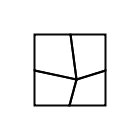

3. **ranDiv**: Double (you can specify a randomDivisor for the randomMiddle- low values randomise more, large values less.  Default is 100, which leads to a very minor level of randomisation.  Try single digit figures for greater distortion)
4. **lineRatios**: Vector2D (relevant to QUAD subdivision, which calculates 'middle' points on existing lines.  Line ratios enables you to define where on the line these points are calculated (you can even calulate them beyond the line by providing values greater than 1 or less than 0).  The default is (.5,.5) to make everything neatly regular.).  The image below shows line ratios set off centre:

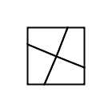

5. **controlPointRatios**: Vector2D (determines how new control points are distributed on lines.  The default is (.25, .75), which places them a quarter of the way on any line and at 75% along the line)
6. **insetTransform**: Transform2D (not pertinent to splines currently, only relevant for line based subdivision - transform echo subdivided shapes) - default is `new Transform2D(new Vector2D(0, 0), new Vector2D(.5, .5), new Vector2D(0, 0))`, which halves the size of the internal echoed shape
7. **continuous**: Boolean (links adjacent mid-points on QUADS when lineRatios differ between x and y (as long as they add up to 1 altogether).  This is necessary because new polygons are effectively rotated relative to one another.  If, for instance, a square is being subdivided, the first new polygon has its origin at the top left original point.  The next has its origin at the top right point, which means that it is notionally rotated 90 degrees in relation to the first polygon.  This notional rotation means that lines calculated non-middle line ratios do not line up.  Selecting continuous makes them line up.) - default is TRUE

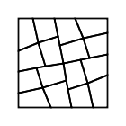
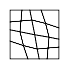

8. **visibilityRule**: Int (polygons can be visible or invisible) - default is ALL.  The Subdivision object stores a number of rules for the visibility of polygons created through subdivision):

- ALL
- QUADS
- TRIS
- ALL_BUT_LAST
- ALTERNATE_ODD
- ALTERNATE_EVEN
- FIRST_HALF
- SECOND_HALF
- EVERY_THIRD
- EVERY_FOURTH
- EVERY_FIFTH
- RANDOM_1_2
- RANDOM_1_3
- RANDOM_1_5
- RANDOM_1_7
- RANDOM_1_10

This QUAD subdivision follows the ALTERNATE_ODD rule.  Polygons 1 and 3 are visible.

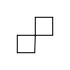

9. **polysTransform**: Boolean (global switch for polygonal transformations) - default TRUE

The more specific subdivision parameters relate to the various ways that polygons produced via subdivision can be transformed. Transformations can occur at the level of overall (whole) polygons or at the level of sets of points within polygons.  The extent of transformation is affected by probability fields, which take percentage values to shape the likelihood of any particular transformation ocurring.


***


##### Whole polygon transformation fields

Whole polygon transformations typically involves the randomisation of aspects of translation, scale and rotation.

Note that the "pTW" prefix on these fields stands for "polygon transform whole".

1. **polysTransformWhole**: Boolean (overall switch for whole polygon level transformations) - default is FALSE
2. **pTW_randomTranslation**: Boolean (switch for randomisation of polygon translation) - default is FALSE
3. **pTW_randomScale**: Boolean (switch for randomisation of polygon scale) - default is FALSE
4. **pTW_randomRotation**: Boolean (switch for randomisation of polygon rotation) - default is FALSE
5. **pTW_commonCentre**: Boolean (if true all transformations occur in relation to a common centre, otherwise to the centres of individual polys) - default is FALSE
6. **pTW_probability**: Double (probability that any given polygon will be transformed (percentage)) - default is 100
7. **pTW_transform**: Transform2D (deterministic rather than random, specify a global transformation) - default is a null transform `new Transform2D(new Vector2D(0, 0), new Vector2D(0, 0), new Vector2D(0, 0))`
8. **pTW_randomCentreDivisor**: Double (randomised value between specified value and the poly centre) - default is 100
9. **pTW_randomTranslationRange**: RangeXY (randomised x y translation value (both x and y have separate min and max values in Range object) - default is null `new RangeXY(new Range(0,0), new Range(0,0))`
10. **pTW_randomScaleRange**: RangeXY (randomised x y scale value (both x and y have separate min and max values in Range object) - default is null transform/identity transform `new RangeXY(new Range(1,1), new Range(1,1))`
11. **pTW_randomRotationRange**: Range (randomised rotation value with min and max) - default is null transform `new Range(0,0)`


***


##### Point level transformation fields

Point level transformations are handled through a plugin architecture, in which various classes that inherit from the abstract "Transform" class are added to an ArrayBuffer of Transforms ("transformSet").  The buffer is then converted to a fixed array ("pTP_transformSet"), which serves as the hub for iteratively performing a variety of point transforms (all those that have been added to the buffer).

The various transforms are targetted at specific sets of points.  Here is the set of currently available transforms.

- **AnchorsLinkedToCentre** (affects anchor and control points that fall at the opposite ends of lines that go to the centre anchor (in the original polygon).  For QUAD subdivision this relates to the two 'middle' points on the first and last lines of the new polygon. In general the options are to shift the anchor points either towards other anchor points (including the centre) and to make associated control points make the same vector shift or remain where they are)
- **CentralAnchors** (central anchor and control points (calculated in relation to original polygon).  There are 16 of these in QUAD subdivision - 8 anchor points and 8 control points.  This once again offers the option to move these central anchors and control points in the direction of other anchors - this creates internal tearing, overlaps, etc.  THe standard thing is to move the central anchors out and away from the actual centre, which creates an opening in the centre of the original polygon).
- **ExteriorAnchors** (all non-centre anchors and control points, offering the option to move them towards or away from the centre)
- **InnerControlPoints** (control points that lie along the lines to the centre - for creating curved lines from center to outside anchors)
- **OuterControlPoints** (control points that lie along the external lines that do not run to the centre - for making shapes bulge or contract)

There are a number of fields within these transforms that can be accessed to modify point transformation.  This is done once the transforms are instantiated within the context of defining subdivision paramters in the `MySketch/createSubdivisionParamsSetCollection` method.  I will describe these fields after I deal with the point transformation fields that are directly available within `SubdivisionParameters`.

The prefix "pTP" stands for "polygon transfrom points".

1. **polysTransformPoints**: Boolean (overall switch for point level transformations) - default is FALSE
2. **pTP_probability**: Double (probability that any given polygon will have its points transformed (percentage)) - default is 100
3. **transformSet**: ArrayBuffer[Transform] (we add transforms to this to build up our transform set.  if we add a transform with the flag of 'false' then it does nothing)
4. **pTP_transformSet**: Array[Transform] (represents transformSet as a fixed array)


***


##### Transform fields

These fields are not directly visible in `MySketch`.  They are accessible but not directly refeerenced.  Each time you create a Transform instance and set it to TRUE then it will run with the default value described in the relevant Transform class.  So you will need to refer to the information here or to the Transform classes themselves to discover the internal fields.

Many of the Boolean fields are mutually exclusive (they belong in radio groups), so you may need to negate any that you don't want to be true that are by default true and adjust those that are by default set to false.

Note that the easiest way to modify the transforms is by the convenience methods described in relation to each of the five transforms below.  They enable specific modificaitons and handle all the background complexity of ensuring boolean fields are properly in synch.


***


###### AnchorsLinkedToCentre

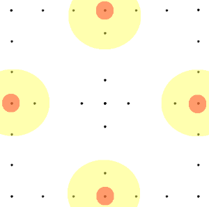

1. **tearing**: Boolean (**constructor parameter**, global switch for this transform) - default in `MySketch/createSubdivisionParamsSetCollection` method is FALSE (switching off this transformation)
2. **probability**: Double (percentage probability that any specific anchor in a subdivision will be transformed) - default is 100
3. **sidesTotal**: Int (number of sides in the original polygon - no need to specify this value, gets calculated internally) - default is 4
4. **numSidesPerPoly**: Int (number of sides for new polygons - no need to specify this value, gets calculated internally) - default is 4 (QUAD subdivision)

'Tear' direction

5. **tearTowardsOutsideCorner**: Boolean (switch to tear points towards the origin anchor (outside corner)) - default is TRUE
6. **tearTowardsOppositeCorner**: Boolean (switch to tear points towards the anchor diagonal to this one (for QUAD subdivision)) - default is FALSE
7. **tearTowardsCentre**: Boolean (switch to tear points towards the centre anchor of the old polygon) - default is FALSE
8. **randomTearType**: Boolean (switch to select a random option between 5 and 7 above) - default is FALSE

'Tear' amount

9. **tearFactor**: Double (a specified tear factor) - default is .45 (calculations occur at normalised level, so employ fractions or extreme results)
10. **randomTear**: Boolean (switch to randomly determine tear factor for each point) - default is FALSE
11. **randomTearFactor**: Range (random tearing ranges) - default is `new Range(-.2, .2)`

Control points follow (or not)

12. **cpsFollow**: Boolean (switch for control points to follow their parent anchor points) - default is TRUE
13. **cpsFollowMultiplier**: Double (following can be multiplied to accentuate or veer away from parent transformation (negative numbers)) - default is 1 (identical transformation)
14. **randomCPsFollow**: Boolean (switch for whether or not the cpsFollowMultiplier should be randomly calculated for each point) - default is FALSE
15. **randomCPsFollowMultiplier**: Range (randomisation occurs in relation to this min/max range) - default is `new Range(-1.5, 1.5)`

**Convenience Methods**

1. `adjustStandardFields (p: Double, tF: Double, cpsF: Boolean, cpsFM: Double, rCPSFollow: Boolean, rCPSFollowMultiplier: Range)` (probability, tearFactor, controlPointsFollow, follow multiplier, random follow, random follow multiplier)
2. `setTearType(tearType: Int)` (AnchorsLinkedToCentre.OUTSIDE_CORNER, ...OPPOSITE_CORNER, ...CENTRE, ...RANDOM)
3. `setRandomTearFactor(f: Range)` (random tear amount)
4. `setRandomCPsFollow(f: Range)` (random control points follow multiplier range)

**Anchors Linked to Centre Transform createSubdivisionParamsSetCollection() example**

***


###### CentralAnchors

This focuses on the central anchor and control points, but also provides scope to shift all remaining points either in the direction that the central points have moved or in the opposite direction.

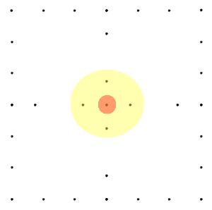

1. **tearing**: Boolean (**constructor parameter**, global switch for this transform) - default in `MySketch/createSubdivisionParamsSetCollection` method is FALSE (switching off this transformation)
2. **probability**: Double (percentage probability that any specific anchor in a subdivision will be transformed) - default is 100
3. **sidesTotal**: Int (number of sides in the original polygon - no need to specify this value, gets calculated internally) - default is 4
4. **numSidesPerPoly**: Int (number of sides for new polygons - no need to specify this value, gets calculated internally) - default is 4 (QUAD subdivision)

'Tear' axes

5. **tearXY**: Boolean (switch to tear on x and y) - default is TRUE
6. **tearX**: Boolean (switch to tear just on x) - default is FALSE
7. **tearY**: Boolean (switch to tear just on y) - default is FALSE
8. **randomTearType**: Boolean (switch to select a random option between 5 and 7 above) - default is FALSE

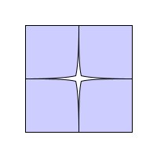
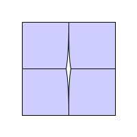
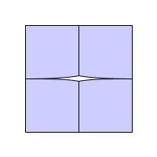

*(Tear XY, X and Y)*


'Tear' direction

9. **tearDiagonal**: Boolean (tear diagonally out from the centre (makes smooth tears)) - default is TRUE
10. **tearLeft**: Boolean (tear towards next anchor) - default is FALSE
11. **tearRight**: Boolean (tear towards previous anchor) - default is FALSE
12. **ranTearDirection**: Boolean (tear at some random vector between left and right anchors) - - default is FALSE

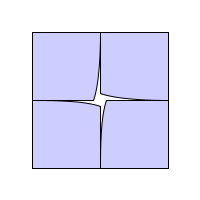
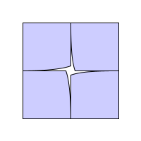

*(Tear Left and Right)*
**Viewing from Centre looking out.**

'Tear' amount

13. **tearFactor**: Double (a specified tear factor) - default is .45 (calculations occur at normalised level, so employ fractions or extreme results)
14. **randomTear**: Boolean (switch to randomly determine tear factor for each point) - default is FALSE
15. **randomTearFactor**: Range (random tearing ranges) - default is `new Range(-.2, .2)`

Control point follow (or not)

16. **cpsFollow**: Boolean (switch for control points to follow their parent anchor points) - default is FALSE
17. **cpsFollowMultiplier**: Double (following can be multiplied to accentuate or veer away from parent transformation (negative numbers)) - default is 1 (identical transformation)
18. **randomCPsFollow**: Boolean (switch for whether or not the cpsFollowMultiplier should be randomly calculated for each point) - default is FALSE
19. **randomCPsFollowMultiplier**: Range (randomisation occurs in relation to this min/max range) - default is `new Range(-1.5, 1.5)`

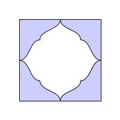
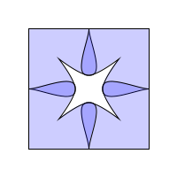
*(Control Points Follow Positive 1, Control Points Follow Negative 1)*

20. **allPointsFollowCentre**: Boolean (remaining poly points follow same vector as adjusted centre has moved from original centre) - default is FALSE
21. **invertedFollowCentre**: Boolean (if true then remaining poly points move in the opposite direction to the central points - only does anything if allPointsFollowCentre is true) - default is FALSE

These last two fields can produce unpredictable and surprising results. 

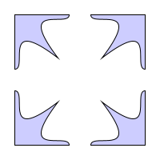 
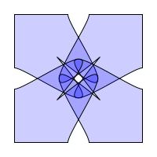 
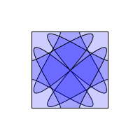 

*(CentralAnchors_tearXY_diagonal_.2_cpsFollow_5_allPointsFollowCentre, CentralAnchors_tearXY_diagonal_.2_cpsFollow_-7_allPointsFollowCentre, CentralAnchors_tearXY_diagonal_5_cpsFollow_5_allPointsFollowCentre_invertedFollowCentre)*

**Convenience Methods**

1. `adjustStandardFields (p: Double, tF: Double, cpsF: Boolean, cpsFM: Double, all: Boolean, inv: Boolean)` (probability, tearFactor, controlPointsFollow, follow multiplier, all points follow CA vector, all points go opposite vector) 
2. `setTearType(tearType: Int)` (CentralAnchors.TEAR_XY, ...TEAR_X, ...TEAR_Y, ...RANDOM_TEAR_TYPE)
3. `setTearDirection(tearDirection: Int)` (CentralAnchors.TEAR-DIAGONAL, ...TEAR_LEFT, ...TEAR_RIGHT, ...RANDOM_TEAR_DIRECTION)
4. `setRandomTearFactor(f: Range)`
5. `setRandomCPsFollow(f: Range)` (multiplier range)

**Central Anchors Transform createSubdivisionParamsSetCollection() example**

Here is just the relevant portion of the method relating to central anchors transform.

```
var centralAnchors: CentralAnchors = new CentralAnchors(true)

//convenience methods for adjusting centralAnchors fields
centralAnchors.adjustStandardFields (100, -.1, true, 3, true, false) //probability, tearFactor, control points follow, cps multiplier, all points follow, inverted following)
centralAnchors.setTearType(CentralAnchors.TEAR_Y)//TEAR_XY, TEAR_Y, RANDOM_TEAR_DIRECTION
centralAnchors.setTearDirection(CentralAnchors.TEAR_DIAGONAL)
centralAnchors.setRandomTearFactor(new Range(-.3, .3))//sets randomTear to true and sets the range
centralAnchors.setRandomCPsFollow(new Range(-2, 2))//sets randomCPsFollow to true and sets the range

transformSet += centralAnchors
```


***


###### ExteriorAnchors

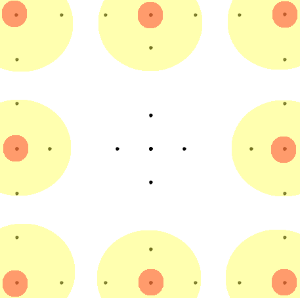

1. **spiking**: Boolean (**constructor parameter**, global switch for this transform) - default in `MySketch/createSubdivisionParamsSetCollection` method is FALSE (switching off this transformation)
2. **probability**: Double (percentage probability that any specific anchor in a subdivision will be transformed) - default is 100
3. **sidesTotal**: Int (number of sides in the original polygon - no need to specify this value, gets calculated internally) - default is 4
4. **numSidesPerPoly**: Int (number of sides for new polygons - no need to specify this value, gets calculated internally) - default is 4 (QUAD subdivision)

The exterior anchors that are affected - (5, 6 & 7 are mutually exclusive - select one)

5. **spikeAllExteriorAnchors**: Boolean (switch to affect all exterior anchors (all but those that correspond to the centre of the original polygon)) - default is TRUE 
6. **spikeCornerAnchors**: Boolean (switch to tear just on just the origin anchor point in original polygon) - default is FALSE
7. **spikeMiddleExteriorAnchors**: Boolean (the anchor points that are established as middle points on existing lines: the 1 and the 3 anchors in a quad polygon) - default is FALSE

Symmetrical or asymmetrical 'spiking'

(9, 10, 11 & 12 are mutually exclusive - select one)
9. **symmetricalSpike**: Boolean (sibling anchors are equally affected: siblings are anchor points that share their location) - default is TRUE
10. **spikeRight**: Boolean (only the right sibling is affected) - default is FALSE
11. **spikeLeft**: Boolean (only the left sibling is affected) - default is FALSE
12. **randomSpikeType**: Boolean (randomly selects one of the above 3 options) - default is FALSE

The 'spiking' axes - (13, 14 & 15 are mutually exclusive - select one)

13. **spikeXY**: Boolean (spike applied to both x & y) - default is TRUE
14. **spikeX**: Boolean (spike applied to x) - default is FALSE
15. **spikeY**: Boolean (spike applied to y) - default is FALSE

The amount of 'spiking'

16. **spikeFactor**: Double (negative numbers make spiking, positive numbers between 0 and .99 move closer to middle (1)) - default is .3
17. **randomSpike**: Boolean (randomly determine spike factor - this leads to unaligned polygon inside corners) - default is FALSE
18. **randomSpikeFactor**: Range (random spiking ranges ) - default is `new Range(-.2, .2)`

Control points follow anchor points (or not)

19. **cpsFollow**: Boolean (switch for control points to follow their parent anchor points) - default is FALSE
20. **cpsFollowMultiplier**: Double (following can be multiplied to accentuate or veer away from parent transformation (negative numbers)) - default is 2
21. **randomCPsFollow**: Boolean (switch for whether or not the cpsFollowMultiplier should be randomly calculated for each point) - default is FALSE
22. **randomCPsFollowMultiplier**: Range (randomisation occurs in relation to this min/max range) - default is `new Range(-1.5, 1.5)`

Control point 'squeezing'

23. **cpsSqueeze**: Boolean (vary the distance between 'perpendicular' control points to create sharper or more bulbous curves to external anchors) - default is FALSE
24. **cpsSqueezeFactor**: Double (multiplier to create the 'squeeze') - default is -.2
25. **randomCPsSqueeze**: Boolean (randomise the squeezing between sets of control points) - default is FALSE
26. **randomCPsSqueezeFactor**: Range (associated range) default is `new Range(-.5, .5)`

**Convenience Methods**

1. `adjustStandardFields (p: Double, sF: Double, cpsF: Boolean, cpsFM: Double, squeeze: Boolean, squeezeF: Double)` (probability, spike factor, control points follow, control points follow multiplier, squeeze factor)
2. `setWhichSpike(which: Int)` (ExteriorAnchors.ALL, ...CORNERS, ...MIDDLES)
3. `setSpikeType(spikeType: Int)` (ExteriorAnchors.SYMMETRICAL, ...RIGHT, ...LEFT, ...RANDOM)
4. `setSpikeAxis(spikeAxis: Int)` (ExteriorAnchors.SPIKE_XY, ...SPIKE_X, ...SPIKE_Y)
5. `setRandomSpikeFactor(f: Range)`
6. `setRandomCPsFollow(f: Range)`
7. `setRandomCPsSqueeze(f: Range)`

**Exterior Anchors Transform createSubdivisionParamsSetCollection() example**


***


###### InnerControlPoints

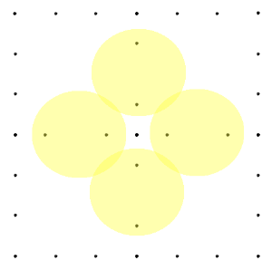

1. **curving**: Boolean (**constructor parameter**, global switch for this transform) - default in `MySketch/createSubdivisionParamsSetCollection` method is FALSE (switching off this transformation)
2. **probability**: Double (percentage probability that any specific anchor in a subdivision will be transformed) - default is 100
3. **sidesTotal**: Int (number of sides in the original polygon - no need to specify this value, gets calculated internally) - default is 4
4. **numSidesPerPoly**: Int (number of sides for new polygons - no need to specify this value, gets calculated internally) - default is 4 (QUAD subdivision)

QUADS (mainly relevant for quads - makes inner control points take account of external control points on outer line (typically to create matching curves))

5. **referToOuter**: Boolean (mainly relevant for quads, best to turn off for tris because angle is too radical) - default is TRUE
6. **followOuter**: Boolean (outside inner control points are placed on the opposite vector relative to the anchor of the external control points (to make things smooth)) - default is TRUE
7. **exaggerateOuter**: Boolean (the left 45 degree vector from external control point) - default is FALSE
8. **counterOuter**: Boolean (directly contradicts the incoming vector from external line) - default is FALSE

If one set of multipliers is even and the other odd then they both move in same direction, if both even or both odd then then move in opposite direction

9. **outerMultiplier**: Vector2D (affects outer inner control points) - default is `new Vector2D(.5,.5)`
10. **innerMultiplier**: Vector2D (affects inner inner control points) - default is `new Vector2D(.1,.1)`

TRIS - mainly used by tris to avoid standard quad following (see just above)

11. **outerRatio**: Double (normally takes a value between -.5 and .5 to place outer control point either to the left or the right of the line between relevant external anchor and centre) - default is 1.1
12. **innerRatio**: Double (normally takes a value between -.5 and .5 to place inner control point either to the left or the right of the line between relevant external anchor and centre) - default is .15
13. **randomRatio**: Boolean (randomised curve ratios) - default is FALSE
14. **ranOuterRatio**: Range (specify a random outer ratio) - default is `new Range(-.5, .5)`
14. **ranInnerRatio**: Range (specify a random inner ratio) - default is `new Range(-.5, .5)`

Adjoining internal lines match (or not)

15. **commonLine**: Boolean (adjoining control points are identically postioned (or not) - if not creates inner overlapping shapes) - default is TRUE

Mutuallly exclusive and onlhy relevant if commonLine is true (select one)

16. **evenCommon**: Boolean (common line taken from left poly of internal line) - default is FALSE
17. **oddCommon**: Boolean (common line taken from right poly of internal line ) - default is FALSE
18. **ranCommon**: Boolean (selects either even or odd) - default is TRUE

**Convenience Methods**

1. `setQuadReferToOuter(approach: Int)` (QUAD - shape inner curve in terms of adjacent outer curve, according to approach(InnerControlPoints.FOLLOW_OUTER, ...EXAGGERATE_OUTER, ...COUNTER_OUTER)
2. `setQuadMultipliers(inner: Vector2D, outer: Vector2D)` (QUAD)
3. `setTriRatios(inner: Double, outer: Double)` (TRI)
4. `setRandomTriRatios(inner: Range, outer: Range)`(TRI)
5. `setCommonLine(common_type: Int)` (TRI)

**Inner Control Points Transform createSubdivisionParamsSetCollection() example**


***


###### OuterControlPoints

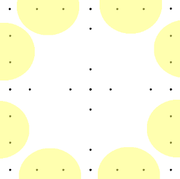

Two ways of calculating outside spline curvature :
1.  First way calculates difference vector between the control point and a notional middle point on the line, then converts that to a perpendicular vector that gets applied to the control point, either bulging it out (postive values or puckering it in (negative values).  A multiplier is then applied to exaggerate the vector. A single curve can both bulge and pinch.  The curveTypes are given in the OuterControlPoints object. PUFF means that all control points on external lines bulge.  PINCH means that they contract into the polygon.  Something like PUFF_PINCH_PUFF_PINCH means that first control point puffs and second pinches, while the second last control point in the new polygon puffs and the last control point pinches. Can also modify the line side ratio to create different curves.  If, for instance, a standard line ratio is (.33, .66), try reversing those figures.

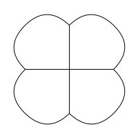
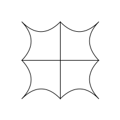
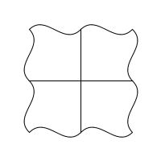

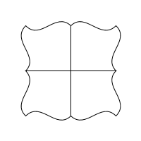
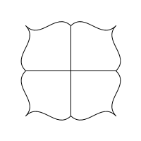

*(top row: PUFF, PINCH, PUFF_PINCH_PUFF_PINCH)*

*(second row: PUFF_PINCH_PINCH_PUFF, PINCH_PUFF_PINCH_PUFF, PINCH_PUFF_PUFF_PINCH)*

2.  Second way takes the vector from the absolute centre of all polygons in subdivision and lerps (linear interpolation) between the centre and the notional midpoint on the outside line. This then gets shifted by the vector difference between the mid point and the control points to move the control points by the same vector. Simple and reliable if there is a symmetrical centre, but can create intresting wave like effects and major distortion when not polygon is uncentred (in Bezier Draw). Works straighforwardly with non QUAD shapes - TRIS, etc.

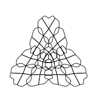
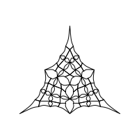

*(Curve from centre positive, curve from centre negative - both over several iterations)*

1. **curving**: Boolean (**constructor parameter**, global switch for this transform) - default in `MySketch/createSubdivisionParamsSetCollection` method is FALSE (switching off this transformation)
2. **probability**: Double (percentage probability that any specific anchor in a subdivision will be transformed) - default is 7
3. **sidesTotal**: Int (number of sides in the original polygon - no need to specify this value, gets calculated internally) - default is 4
4. **numSidesPerPoly**: Int (number of sides for new polygons - no need to specify this value, gets calculated internally) - default is 4 (QUAD subdivision)
5. **absoluteCentre**: Vector2D(this is only needed when curveFromCentre is true (see below)) - default is `new Vector2D(0,0)`
6. **midLineRatio**: Double (for calculating the initial middle) - default is .5

For calculating positions of control points along the outside line

7. **lineSideRatio**: Vector2D (first value for first control point on outer spline, second for next) - default is `new Vector2D(.4, .6)`
8. **randomLineRatio**: Boolean (calculate random ratios) - default is FALSE
9. **randomLineRatioA**: Range (specify a random outer ratio) - default is `new Range(.1, .5)`
10. **randomLineRatioB**: Range (specify a random inner ratio) - default is `new Range(.5, .9)`

The remaining fields are curving focused.

11. **curveFromCentre**: Boolean = (set this to FALSE if you want perpendicular curving) - default is FALSE

Perpendicular curving:

12. **curveType**: Int (OuterControlPoints.PUFF, ...PINCH, ...PUFF_PINCH_PUFF_PINCH, ...PUFF_PINCH_PINCH_PUFF, ...PINCH_PUFF_PINCH_PUFF, ...PINCH_PUFF_PUFF_PINCH) - default is PUFF
13. **var curveMultiplier**: Double (factor to exaggerate curving) - default is 5
14. **randomMultiplier**: Boolean (flag to randomise curving multiplier) - default is FALSE
15. **randomCurveMultiplier**: Range (min and maxs for randomisation) - default is `new Range(.5, 3)`

Curve from centre curving:

16. **curveFromCentreRatio**: Vector2D (x is for control point next to 0, y for one next to 3 (same system as curveRatio)) - default is `new Vector2D(.2, -.5)`
17. **ranCurveFromCentre**: Boolean (calculate random curve from centre) - default is FALSE
18. **ranCurveFromCentreRatioA**: Range (for control point next to point 0) - default is `new Range(-1, 1)`
19. **ranCurveFromCentreRatioB**: Range (for control point next to point 3) - default is `new Range(-1, 1)`

**Convenience Methods**

1. `setRandomLineSideRatio(innerRatio: Vector2D, outerRatio: Vector2D)` (first control point on spline line ratio (distance from first anchor), second control point on spline line ratio (distance from first anchor))
2. `curvePerpendicular(prob: Double, cType: Int, lineRatio: Vector2D, cMultiplier: Range)` (probability, curve type, line ratio, curve multiplier)
3. `curvePerpendicularRandomMultiplier(prob: Double, cType: Int, lineRatio: Vector2D, cRandomMultiplier: Range)` (probability, , curve type, line ratio, random curve multiplier)
4. `curveFromCentre(prob: Double, cRatio: Vector2D)` (probability, curve ratios)
5. `curveFromCentreRandom(prob: Double, cp1Ratio: Range, cp2Ratio: Range)` (probability, curve ratios (control point 1), curve ratios (control point 2))

**Outer Control Points Transform createSubdivisionParamsSetCollection() example**

```

var outerControlPoints: OuterControlPoints = new OuterControlPoints(true)
//outerControlPoints.curvePerpendicular(100, outerControlPoints.PUFF, new Vector2D(.33, .66), new Range(2, 2))
//outerControlPoints.curvePerpendicularRandomMultiplier(100, OuterControlPoints.PUFF, new Vector2D(.33, .66), new Range(2, 5))
outerControlPoints.curveFromCentre(100, new Vector2D(-.3, -.3))
transformSet += outerControlPoints

```

***


## Subdivision note
Urgently need a more efficient means of building complex subdivision parameters.  Also need to save and load them from XML.